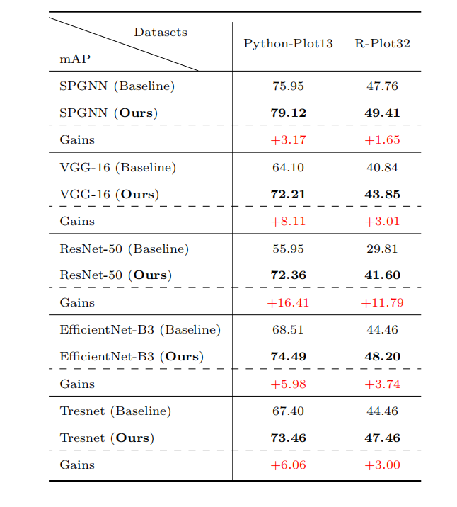

# MSTIL: Multi-cue Shape-aware Transferable Imbalance Learning for Effective Graphic API Recommendation

**The code of MSTIL: Multi-cue Shape-aware Transferable Imbalance Learning for Effective Graphic API Recommendation.**

# The required resources

The Module is a required package for calling EfficientNet-b3.

Datasets and other resources are available at https://pan.baidu.com/s/1I8btvuLwn5w3GnI-ZCV3Ew (the code is ISSE).

# Train and Test

To train the model with MSTIL (resnet for example):
```shell
python resnet.py -g [the id of your gpu]
```

To test the model trained with MSTIL (resnet for example):
```shell
python resnet50_test.py -g [the id of your gpu]
```
# The result of our model
The performance of models with standard training (Baseline) or with MSTIL on all
datasets.

 The performance of models With MSTIL or with standard training (Baseline) on
the Python-Plot13 dataset. The AP of APIs with test samples more than 10 are also shown
as follows.

The performance of models with MSTIL or with standard training (Baseline) on
R-Plot32 dataset. The AP of APIs with test samples more than 10 are also shown as follows.

# Citation
**If you find this code to be useful for your research, please consider citing.**
